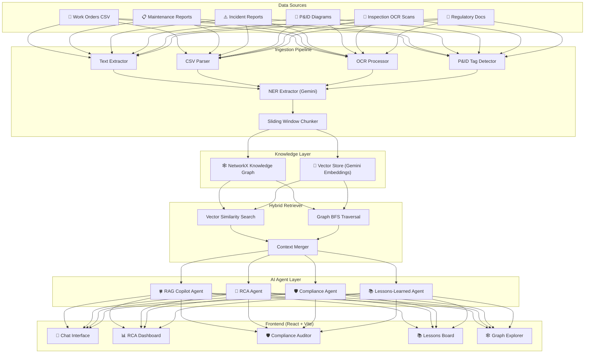

# 🍀 PlantMind — Unified Asset & Operations Brain

> **AI-powered industrial knowledge management platform** that transforms scattered maintenance logs, SOPs, P&IDs, and regulatory documents into a queryable knowledge graph with multi-agent AI copilots.

Built for the **ET AI Hackathon 2.0** 🏆

---

## 🎯 Problem Statement

Industrial plants generate **thousands of documents** — work orders, incident reports, safety procedures, regulatory compliance records, and engineering diagrams. Today these are siloed in PDFs, CSVs, and legacy systems. When a field technician needs to troubleshoot a pump failure at 2 AM, they're searching through filing cabinets, not querying an intelligent brain.

**PlantMind** solves this by ingesting all plant documentation into a unified **Knowledge Graph**, then deploying specialized **Gemini-powered AI agents** that can:

- Answer natural-language questions with **citations and cross-document insights**
- Perform **automated root cause analysis** on equipment failures
- Audit **regulatory compliance gaps** against OISD and Factory Act standards
- Extract **proactive lessons learned** from recurring failure patterns

---

## 🏗️ Architecture



---

## ✨ Key Features

| Feature | Description | Gemini API Usage |
|---------|-------------|------------------|
| **RAG Copilot** | Natural language Q&A with citations and confidence scoring | `gemini-2.0-flash` for generation, `embedding-001` for retrieval |
| **Root Cause Analysis** | Automated failure mode detection and corrective action plans | `gemini-2.0-flash` structured JSON output |
| **Compliance Auditor** | Maps equipment against OISD/Factory Act regulatory requirements | `gemini-2.0-flash` audit analysis |
| **Lessons Learned** | Cross-equipment pattern detection for proactive maintenance | `gemini-2.0-flash` pattern synthesis |
| **Knowledge Graph** | NetworkX-based entity-relationship mapping with BFS traversal | NER entity extraction via Gemini |
| **Hybrid Retrieval** | Combines vector cosine similarity + graph traversal for rich context | `embedding-001` embeddings |

---

## 📂 Project Structure

```
PlantMind ET/
├── README.md                     # This file
├── PlantMind_PRD.md              # Product Requirements Document
├── docs/steps/                   # Implementation step guides
│
└── plantmind/                    # Main application
    ├── .env                      # Environment variables (GOOGLE_API_KEY)
    ├── requirements.txt          # Python dependencies
    │
    ├── api/                      # FastAPI backend
    │   ├── main.py               # Application entry point
    │   ├── config.py             # Environment configuration
    │   └── routes/
    │       ├── query.py          # RAG Copilot endpoint
    │       ├── ingest.py         # Document ingestion endpoint
    │       ├── agents.py         # Specialist agent endpoints
    │       └── graph.py          # Knowledge graph endpoints
    │
    ├── ingestion/                # Document processing pipeline
    │   ├── pipeline.py           # Orchestrator
    │   ├── schemas.py            # Pydantic models
    │   ├── chunker.py            # Sliding window text chunker
    │   ├── pdf_extractor.py      # PDF/TXT text extractor
    │   ├── ocr_processor.py      # OCR image scanner (with text fallback)
    │   ├── pid_detector.py       # P&ID tag regex detector
    │   ├── csv_parser.py         # Structured CSV reader
    │   └── ner_extractor.py      # Gemini NER entity extraction
    │
    ├── graph/                    # Knowledge graph engine
    │   ├── schema.py             # Node/Edge type definitions
    │   ├── graph_store.py        # NetworkX graph operations
    │   ├── vector_store.py       # Local vector store (Gemini embeddings)
    │   ├── loader.py             # Graph & vector loader utilities
    │   └── queries.py            # Pre-built analytical queries
    │
    ├── agents/                   # AI agent modules
    │   ├── retriever.py          # Hybrid vector + graph retriever
    │   ├── rag_copilot.py        # Main Q&A copilot (Gemini)
    │   ├── rca_agent.py          # Root Cause Analysis agent
    │   ├── compliance_agent.py   # Regulatory compliance auditor
    │   └── lessons_learned_agent.py  # Proactive lessons extractor
    │
    ├── scripts/
    │   └── build_graph.py        # End-to-end graph builder script
    │
    ├── data/
    │   ├── sample_docs/          # Sample industrial corpus
    │   │   ├── maintenance/      # Work orders, reports
    │   │   ├── safety_procedures/ # SOPs, emergency procedures
    │   │   ├── inspection_reports/ # OCR scans, P&ID text
    │   │   └── regulatory/       # OISD, Factory Act excerpts
    │   └── ground_truth.json     # 15 fact-checking test questions
    │
    └── web/                      # React + Vite frontend
        ├── index.html
        ├── package.json
        └── src/
            ├── main.jsx
            ├── index.css         # Design system tokens
            ├── App.jsx           # Navigation shell
            ├── App.css
            └── components/
                ├── ChatView.jsx / .css       # RAG Copilot chat
                ├── DashboardView.jsx / .css  # RCA dashboard
                ├── ComplianceView.jsx / .css  # Compliance auditor
                ├── LessonsView.jsx / .css     # Lessons learned
                └── GraphView.jsx / .css       # Graph explorer
```

---

## 🚀 Quick Start

### Prerequisites

- **Python 3.10+**
- **Node.js 18+**
- **Google Gemini API Key** ([Get one here](https://aistudio.google.com/apikey))

### 1. Clone & Setup Environment

```bash
git clone <repo-url>
cd "PlantMind ET/plantmind"

# Create Python virtual environment
python -m venv venv
venv\Scripts\activate        # Windows
# source venv/bin/activate   # macOS/Linux

# Install Python dependencies
pip install -r requirements.txt
```

### 2. Configure API Key

```bash
# Edit .env file and set your Gemini API key
# GOOGLE_API_KEY=your_key_here
```

### 3. Build the Knowledge Graph

```bash
cd plantmind
python -m scripts.build_graph
```

This will:
- Ingest all sample documents from `data/sample_docs/`
- Extract entities using Gemini NER
- Build the NetworkX knowledge graph
- Generate vector embeddings for all chunks
- Save `knowledge_graph.json` and `vector_db_mock.json` to `data/`

### 4. Start the Backend

```bash
python -m api.main
# Server starts at http://localhost:8000
# API docs at http://localhost:8000/docs
```

### 5. Start the Frontend

```bash
cd web
npm install
npm run dev
# Frontend starts at http://localhost:5173
```

---

## 🔌 API Reference

| Method | Endpoint | Description |
|--------|----------|-------------|
| `POST` | `/api/v1/query` | Ask a question to the RAG Copilot |
| `POST` | `/api/v1/agents/rca` | Run root cause analysis for an equipment tag |
| `POST` | `/api/v1/agents/compliance` | Run compliance gap audit |
| `POST` | `/api/v1/agents/lessons` | Extract lessons learned patterns |
| `POST` | `/api/v1/ingest/batch` | Ingest documents into the pipeline |
| `GET`  | `/api/v1/graph/stats` | Get knowledge graph statistics |
| `GET`  | `/api/v1/graph/nodes` | List graph nodes (filterable by type) |
| `GET`  | `/api/v1/graph/export` | Export full graph for visualization |
| `GET`  | `/api/v1/graph/equipment/{tag}` | Get equipment history & relationships |
| `GET`  | `/health` | System health check |

### Example Query

```bash
curl -X POST http://localhost:8000/api/v1/query \
  -H "Content-Type: application/json" \
  -d '{"question": "What is the root cause of C-302 compressor seal failures?"}'
```

---

## 🧪 Sample Corpus

The included sample corpus simulates **Coastal Refinery Unit-3** with:

| Document | Content |
|----------|---------|
| `work_orders.csv` | 8 maintenance work orders for P-104, C-302, HX-201, V-045 |
| `maintenance_report_P104.txt` | Vibration analysis report for centrifugal pump |
| `incident_report_C302.txt` | Compressor mechanical seal failure investigation |
| `SOP_emergency_shutdown.txt` | Emergency shutdown procedure for Unit-3 |
| `pid_unit3_annotations.txt` | P&ID tag annotations for process flow |
| `inspection_scan_HX201.txt` | Heat exchanger tube thickness inspection |
| `OISD_STD_154_excerpt.txt` | Safety instrumented systems standard |
| `factory_act_excerpt.txt` | Hazardous process safety requirements |

---

## 🛡️ Gemini API Integration

PlantMind uses the Google Gemini API across every layer:

1. **`gemini-2.0-flash`** — All agent generation (Q&A, RCA, compliance, lessons)
2. **`models/embedding-001`** — Document chunk embeddings for vector similarity search
3. **Structured JSON output** — `response_mime_type="application/json"` for reliable parsing
4. **NER extraction** — Entity extraction from unstructured maintenance text

### Offline Fallback

All agents include **hardcoded offline fallback responses** so the application works without an API key for demo/evaluation purposes. When `GOOGLE_API_KEY` is not set, agents return pre-computed results based on the sample corpus.

---

## 📊 Ground Truth Evaluation

The `data/ground_truth.json` file contains **15 fact-checking questions** covering:

- Equipment specifications (e.g., "What is the vibration reading on P-104?")
- Incident details (e.g., "What caused the C-302 seal failure?")
- Regulatory requirements (e.g., "What is the OISD valve response time limit?")
- Cross-document insights (e.g., "Which equipment shares misalignment as root cause?")

---

## 🧑‍💻 Tech Stack

| Layer | Technology |
|-------|-----------|
| **AI/LLM** | Google Gemini 2.0 Flash, Embedding-001 |
| **Backend** | Python 3.10+, FastAPI, Uvicorn |
| **Knowledge Graph** | NetworkX (directed graph) |
| **Vector Store** | Custom NumPy cosine similarity engine |
| **NLP/NER** | Gemini-powered entity extraction |
| **Frontend** | React 19, Vite 8, Lucide React icons |
| **Styling** | Vanilla CSS with glassmorphism design system |

---

## 📜 License

Built for the Google Gemini API Developer Competition 2025.

---

<p align="center">
  <strong>🍀 PlantMind — Making industrial knowledge accessible, actionable, and intelligent.</strong>
</p>
