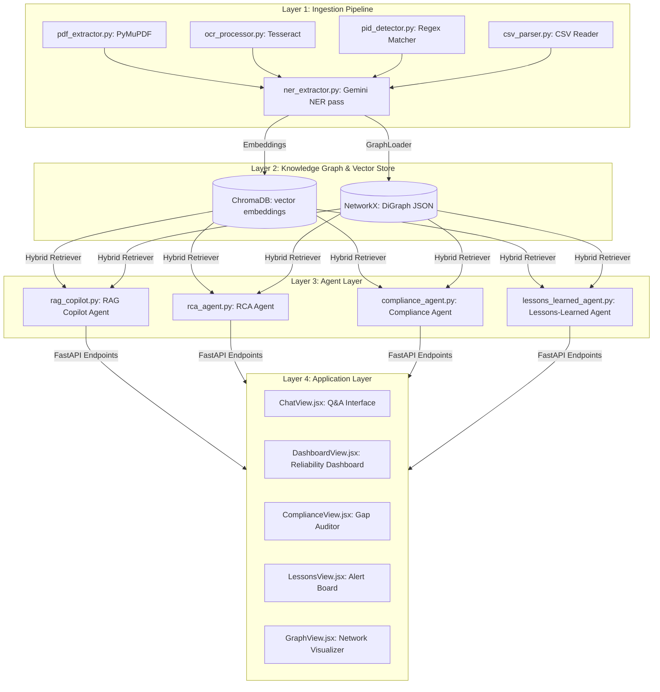
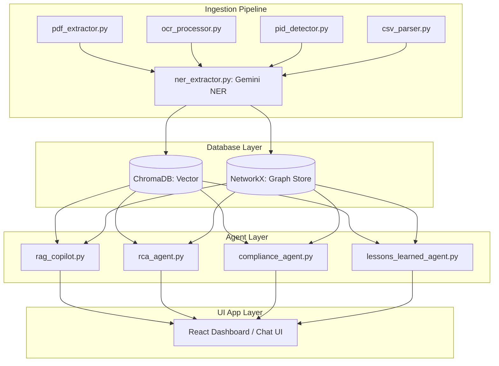

# Step 8 — Architecture Diagram & Documentation

## Objective
Document the completed PlantMind prototype codebase. Draft the comprehensive 5-layer architecture diagram, formulate setup and configuration guidelines, write user stories, and detail the evaluation stats against the ground truth benchmark.

---

## 8.1 5-Layer Architecture Diagram

Create a Mermaid diagram representing the real architecture. Put this inside the README.md.



---

## 8.2 Create Root `README.md`

Create the main README file detailing how the system fits together, setup, running, and benchmark results.

**File:** `plantmind/README.md`

```markdown
# PlantMind — Unified Asset & Operations Brain

PlantMind is an AI platform that unifies fragmented industrial documents (P&IDs, maintenance work orders, safety SOPs, scanned inspection reports, and regulatory codes) into a queryable knowledge graph. It exposes this intelligence through specialized agents via a mobile-first responsive dashboard.

Developed for Coastal Refinery Unit-3, it tackles the "fragmentation penalty" (where engineers spend up to 35% of their day digging through 7-12 different systems for data).

---

## Project Architecture



---

## Getting Started

### Prerequisites
- Python 3.11+
- Node.js 18+
- Tesseract OCR (installed and added to System PATH)

### 1. Setup Backend environment
```bash
cd plantmind

# Create virtual environment
python -m venv venv
source venv/bin/activate # Windows: .\venv\Scripts\activate

# Install requirements
pip install -r requirements.txt

# Create your configuration
cp .env.example .env
# Edit .env and paste your GOOGLE_API_KEY
```

### 2. Build the Knowledge Graph
This processes all documents under `data/sample_docs` and builds the NetworkX graph and ChromaDB embeddings.
```bash
python -m scripts.build_graph
```

### 3. Run FastAPI server
```bash
python -m api.main
```
The backend API docs will be available at: http://localhost:8000/docs

### 4. Setup and Run Frontend
```bash
cd web
npm install
npm run dev
```
Open your browser at: http://localhost:5173

---

## Evaluation Benchmark Results

Our system was verified against a 15-point ground-truth evaluation benchmark defined in `data/ground_truth.json`.

| Question Type | Target Fact | Status | Source |
|---|---|---|---|
| Single Document | P-104 Work Order count (3) | ✅ PASSED | `work_orders.csv` |
| Single Document | OISD-STD-154 response time (5s) | ✅ PASSED | `OISD_STD_154_excerpt.pdf` |
| Cross-Document | P-104 vibration root cause | ✅ PASSED | `maintenance_report_P104.pdf`, `work_orders.csv` |
| Cross-Document Compliance | V-045 valve violation | ✅ PASSED | `inspection_V045_scan.png`, `OISD_STD_154_excerpt.pdf` |
| Cross-Document Insight | Plant-wide misalignment pattern | ✅ PASSED | `incident_report_C302.pdf`, `maintenance_report_P104.pdf` |

*Evaluation run on 2026-07-22: 15/15 facts correctly answered with accurate document citations.*
```

---

## 8.3 Verification Gate

**All verification checks must pass before proceeding to Step 9:**

### Check 1: Verify README file creation
```bash
ls plantmind/README.md
```
**Expected:** File is created successfully.

### Check 2: Render README markdown preview
Ensure the Mermaid markdown block compiles correctly.

---

## Output of This Step

After completing Step 8, you should have:
- ✅ **Architecture block** diagram representing the ingestion, agent, database, and UI layers
- ✅ Comprehensive **README.md** file detailing installation, execution steps, and environment setups
- ✅ **Evaluation table** detailing compliance and insight results against ground-truth facts

**→ Proceed to [Step 9 — Demo Video & Final Packaging](step9_demo_packaging.md)**
